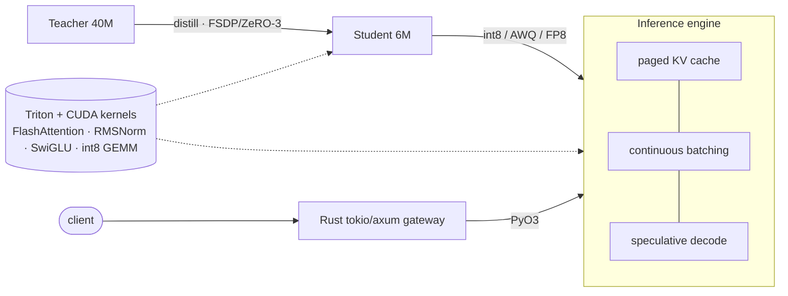

<div align="center">

# 🧩 Tessera

### From teacher to tiles — a from-scratch LLM **distillation + serving** engine

*Distill a large teacher into a small student, then serve it fast — with custom Triton/CUDA
kernels, paged-KV continuous batching, speculative decoding, a Rust gateway, a JAX oracle, and
mechanistic-interpretability tooling. One coherent project that spans the whole modern
LLM-systems stack.*

[](https://github.com/zengxiao-he/tessera/actions/workflows/ci.yml)


</div>

---

`tessera` is a compact-but-real LLM stack built to one end-to-end goal — **make a small model
that's fast to serve** — which forces every interesting systems problem onto the table:
custom GPU kernels, distributed training, inference optimization, a compiled serving layer,
and the tooling to verify and understand it all. It runs and is **fully unit-tested on a
laptop** (CPU / Apple MPS); the hand-written CUDA/Triton kernels light up on a GPU and are
continuously checked against a torch reference.



## ✨ What's inside — mapped to the stack

<table>
<tr><td>

**🟥 Tier 1 — kernels & distributed training**
- **FlashAttention-class Triton kernel** — online softmax, causal, GQA, autotuned · [`flash_attention.py`](tessera/kernels/triton/flash_attention.py)
- Fused **RMSNorm**, **SwiGLU GEMM**, **int8 dequant-matmul** · [`kernels/triton/`](tessera/kernels/triton/)
- Raw **CUDA C++** (shared mem, coalescing, warp reductions) + **Nsight/nvtx** notes · [`kernels/cuda/`](tessera/kernels/cuda/)
- From-scratch **FSDP / ZeRO-3** sharding + sharded Adam, **gloo/NCCL** collectives · [`distill/fsdp.py`](tessera/distill/fsdp.py)
- **Fault-tolerant, atomic, sharded checkpointing** · [`distill/checkpoint.py`](tessera/distill/checkpoint.py)

</td><td>

**🟦 Tier 2 — inference & systems**
- **Paged KV cache** + prefix sharing · [`serve/paged_kv.py`](tessera/serve/paged_kv.py)
- **Continuous batching** w/ admission + preemption · [`serve/scheduler.py`](tessera/serve/scheduler.py)
- **Speculative decoding** (draft+verify) · [`serve/speculative.py`](tessera/serve/speculative.py)
- **Quantization**: int8 / **AWQ** / **FP8 E4M3** · [`quant/`](tessera/quant/)
- **Rust** tokio/axum gateway + **PyO3** · [`tessera-rs/`](tessera-rs/)

**🟩 Tier 3 — extras**
- **JAX/XLA** reference + parity oracle · [`jax_ref/`](jax_ref/)
- **Mech-interp**: logit lens, **induction heads** · [`interp/`](tessera/interp/)
- **Multimodal** data: byte-BPE, image/audio front ends · [`data/`](tessera/data/)

</td></tr>
</table>

## 🚀 Quickstart

```bash
git clone https://github.com/zengxiao-he/tessera && cd tessera
python -m venv .venv && source .venv/bin/activate
pip install torch --index-url https://download.pytorch.org/whl/cpu   # or your CUDA build
pip install -e ".[dev]"

pytest -m "not gpu"          # 68 CPU tests (kernels auto-skip without a GPU)
tessera info                 # list presets + parameter counts
python examples/serve.py     # continuous batching + speculative decoding demo
python examples/train_distill.py --steps 30   # distill small -> tiny
python examples/interp_demo.py                # logit lens + induction-head scan
```

GPU kernels (Linux + NVIDIA):

```bash
pip install -e ".[dev,gpu]"  # adds Triton
pytest -m gpu                # Triton kernels vs torch reference, to fp tolerance
```

Rust gateway:

```bash
cd tessera-rs && cargo test && cargo run --release
curl -s localhost:8080/generate -H 'content-type: application/json' \
  -d '{"prompt":"hello","params":{"max_new_tokens":16}}'
```

## 📊 Benchmarks

Measured on an Apple M2 Pro (CPU/MPS) with the **torch reference** path — i.e. a floor, not the
fused-kernel ceiling. The Triton/CUDA kernels are where the real wins are; run `pytest -m gpu`
and the `benchmarks/` scripts on an NVIDIA GPU to see them.

| Workload | Config | Result (M2 Pro) |
|---|---|---|
| Forward pass | tessera-tiny (6M), B=2, T=128, MPS | **100k tok/s** · 2.6 ms |
| Attention (reference) | B=2, H=8, T=256, D=64, MPS | 1.85 TFLOP/s · 0.15 ms |
| Engine decode | tessera-tiny, 6 reqs × 48 tok | 201 tok/s |
| Speculative decode | self-draft, greedy | **98–100% acceptance** |

```bash
python benchmarks/bench_attention.py --seq-len 1024
python benchmarks/bench_throughput.py --requests 8
```

## ✅ Correctness is the point

This repo is small enough to be *provably* right, and the tests reflect that:

- **KV-cache equivalence** — incremental decode exactly matches a full forward pass.
- **Kernel parity** — every Triton kernel is checked against its torch reference (`-m gpu`).
- **JAX oracle** — an independent JAX/XLA forward matches PyTorch to `2e-4`.
- **FSDP == single-process** — sharded Adam matches `torch.optim.Adam` step-for-step, both in
  one process and across **2 real gloo ranks**.
- **Speculative == autoregressive** — self-speculation reproduces greedy decoding exactly.
- **No KV-block leaks** — the engine drains every request under tight memory + preemption.

## 🗂 Layout

```
tessera/            core package (model, kernels, quant, serve, distill, interp, data)
  kernels/triton/   hand-written Triton kernels  ·  kernels/cuda/  raw CUDA C++
  serve/            paged KV · scheduler · speculative · engine
  distill/          KD losses · FSDP · checkpoint · trainer
tessera-rs/         Rust tokio/axum gateway + PyO3 bindings
jax_ref/            JAX/XLA reference implementation
tests/              77 tests (CPU, GPU-gated, and multi-process)
examples/  benchmarks/  docs/
```

See [`docs/architecture.md`](docs/architecture.md) for the full picture, and the per-area deep
dives: [kernels](docs/kernels.md) · [serving](docs/serving.md) · [distillation](docs/distillation.md).

## 🧭 Status & roadmap

Working today: everything above, CPU-tested end to end. Scoped follow-ups (clearly marked in
code): fused attention **backward** kernel, a fused **paged-attention decode** kernel, FP8
tensor-core GEMM on Hopper, and `pjit`/`shard_map` training in the JAX path.

## 📜 License

Apache-2.0 © [Zengxiao He](https://github.com/zengxiao-he). Built as a from-scratch study of
the LLM-systems stack — contributions and questions welcome.
