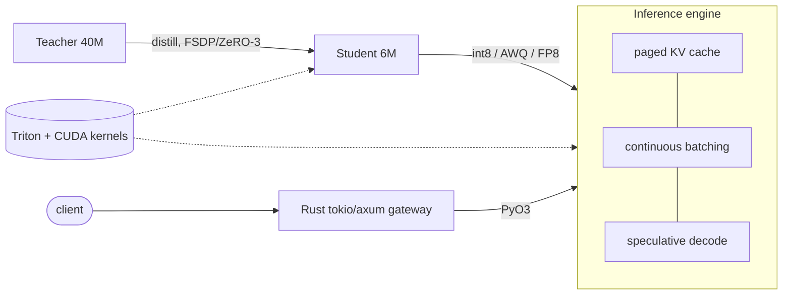

# Tessera

A small, from-scratch LLM stack built around one goal: distill a large teacher into a small
student, then serve that student efficiently. Keeping that goal end-to-end means touching most
of the pieces that matter in practice — custom GPU kernels, sharded training, an inference
engine, quantization, and a serving front end — without any of it being a toy.

[](https://github.com/zengxiao-he/tessera/actions/workflows/ci.yml)


It runs and is unit-tested on a laptop (CPU or Apple MPS). The Triton/CUDA kernels are written
for NVIDIA GPUs; on anything else the model transparently falls back to a torch reference, and
the kernels are checked against that reference whenever a GPU is available.



## What's in it

Training side:

- Decoder transformer with RMSNorm, RoPE, grouped-query attention and SwiGLU ([`tessera/model`](tessera/model)).
- Knowledge-distillation losses: temperature-scaled KL, optional hard CE, hidden-state matching ([`distill/losses.py`](tessera/distill/losses.py)).
- FSDP/ZeRO-3 written from scratch — flat-parameter sharding with a sharded Adam optimizer. It's checked to be numerically identical to single-process training, in one process and across two gloo ranks ([`distill/fsdp.py`](tessera/distill/fsdp.py)).
- Atomic, sharded checkpoints with resume-from-latest ([`distill/checkpoint.py`](tessera/distill/checkpoint.py)).

Kernels:

- A FlashAttention forward kernel in Triton: online softmax, causal masking, GQA, autotuned tile sizes ([`kernels/triton/flash_attention.py`](tessera/kernels/triton/flash_attention.py)).
- Fused RMSNorm, a fused SwiGLU GEMM, and an int8 weight-only matmul that dequantizes in the K-loop ([`kernels/triton`](tessera/kernels/triton)).
- Raw CUDA C++ versions of RMSNorm and attention for the low-level memory work, plus nvtx ranges and Nsight notes ([`kernels/cuda`](tessera/kernels/cuda)).

Serving:

- Block-paged KV cache with a ref-counted allocator for prefix sharing ([`serve/paged_kv.py`](tessera/serve/paged_kv.py)).
- A continuous-batching scheduler that recomposes the batch every step, with admission control and preemption under memory pressure ([`serve/scheduler.py`](tessera/serve/scheduler.py)).
- Speculative decoding with the standard accept/reject sampling ([`serve/speculative.py`](tessera/serve/speculative.py)).
- Post-training quantization: int8 weight-only, AWQ, and an FP8 (E4M3) path ([`quant`](tessera/quant)).
- A Rust gateway (tokio + axum) that handles HTTP and admission back-pressure and calls into the Python engine over PyO3 ([`tessera-rs`](tessera-rs)).

Extras:

- A JAX/XLA reimplementation of the forward pass, used as an independent parity check against PyTorch ([`jax_ref`](jax_ref)).
- Interpretability helpers: activation hooks, a logit lens, and induction-head detection ([`interp`](tessera/interp)).
- A byte-level BPE tokenizer plus image-patch and log-mel audio front ends for multimodal data ([`data`](tessera/data)).

## Quickstart

```bash
git clone https://github.com/zengxiao-he/tessera && cd tessera
python -m venv .venv && source .venv/bin/activate
pip install torch --index-url https://download.pytorch.org/whl/cpu   # or a CUDA build
pip install -e ".[dev]"

pytest -m "not gpu"          # CPU tests; the kernel tests skip without a GPU
tessera info                 # list presets and parameter counts
python examples/serve.py     # continuous batching + speculative decoding
python examples/train_distill.py --steps 30
python examples/interp_demo.py
```

On a Linux box with an NVIDIA GPU:

```bash
pip install -e ".[dev,gpu]"  # adds Triton
pytest -m gpu                # Triton kernels vs the torch reference
```

Rust gateway:

```bash
cd tessera-rs && cargo test && cargo run --release
curl -s localhost:8080/generate -H 'content-type: application/json' \
  -d '{"prompt":"hello","params":{"max_new_tokens":16}}'
```

## Benchmarks

These are from an Apple M2 Pro running the torch reference path, so treat them as a floor
rather than what the fused kernels do on a real GPU. Run `pytest -m gpu` and the scripts in
`benchmarks/` on NVIDIA hardware for the numbers that actually matter.

| Workload | Config | M2 Pro |
|---|---|---|
| Forward pass | tessera-tiny (6M), B=2, T=128, MPS | ~100k tok/s, 2.6 ms |
| Attention (reference) | B=2, H=8, T=256, D=64, MPS | 1.85 TFLOP/s, 0.15 ms |
| Engine decode | tessera-tiny, 6 reqs x 48 tok | ~200 tok/s |
| Speculative decode | self-draft, greedy | 98-100% acceptance |

```bash
python benchmarks/bench_attention.py --seq-len 1024
python benchmarks/bench_throughput.py --requests 8
```

## Tests

The repo is small enough to test thoroughly, and most of the tests check a property rather
than a fixed output:

- Incremental decode with the KV cache matches a full forward pass.
- Each Triton kernel matches its torch reference within fp tolerance (run with `-m gpu`).
- The JAX forward matches PyTorch to about 2e-4.
- Sharded Adam matches `torch.optim.Adam` step for step, in one process and over two gloo ranks.
- Self-speculation reproduces greedy decoding exactly.
- The engine drains every request under tight memory and preemption without leaking KV blocks.

## Layout

```
tessera/            model, kernels, quant, serve, distill, interp, data
  kernels/triton/   Triton kernels      kernels/cuda/  raw CUDA C++
  serve/            paged KV, scheduler, speculative, engine
  distill/          KD losses, FSDP, checkpoint, trainer
tessera-rs/         Rust tokio/axum gateway + PyO3 bindings
jax_ref/            JAX/XLA reference
tests/  examples/  benchmarks/  docs/
```

More detail in [docs/architecture.md](docs/architecture.md), with notes on the
[kernels](docs/kernels.md), [serving](docs/serving.md), and [distillation](docs/distillation.md).

## Status

Everything above works and is tested on CPU. Things I haven't done yet, marked in the code:
a fused attention backward kernel, a fused paged-attention decode kernel, an FP8 tensor-core
GEMM for Hopper, and `pjit`/`shard_map` training on the JAX side.

## License

Apache-2.0, © Zengxiao He.
