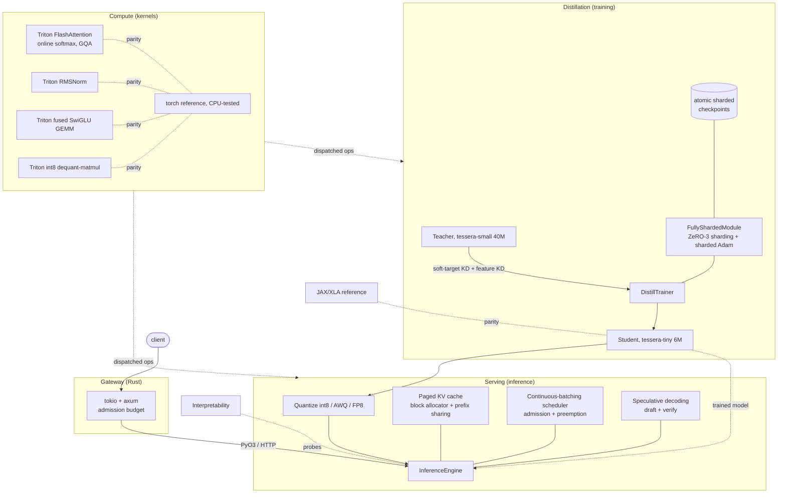

# Architecture

The whole thing is one pipeline: distill a large teacher into a small student, then serve the
student. Each layer of the stack shows up because that end-to-end goal needs it, not because
it was bolted on.

## Where each piece lives

| Area | Component | File |
|---|---|---|
| Kernels | FlashAttention forward (online softmax, GQA) | [`kernels/triton/flash_attention.py`](../tessera/kernels/triton/flash_attention.py) |
| Kernels | Raw CUDA C++ (shared memory, coalescing, warp reductions) | [`kernels/cuda/`](../tessera/kernels/cuda/) |
| Kernels | nvtx ranges + Nsight notes | [`profiling/nvtx.py`](../tessera/profiling/nvtx.py), [cuda/README](../tessera/kernels/cuda/README.md) |
| Distributed | FSDP/ZeRO-3 sharding + sharded Adam, gloo/NCCL | [`distill/fsdp.py`](../tessera/distill/fsdp.py) |
| Distributed | Atomic sharded checkpoint/resume | [`distill/checkpoint.py`](../tessera/distill/checkpoint.py) |
| Inference | Paged KV cache, prefix sharing | [`serve/paged_kv.py`](../tessera/serve/paged_kv.py) |
| Inference | Continuous batching, admission, preemption | [`serve/scheduler.py`](../tessera/serve/scheduler.py) |
| Inference | Speculative decoding | [`serve/speculative.py`](../tessera/serve/speculative.py) |
| Inference | int8 / AWQ / FP8 quantization | [`quant/`](../tessera/quant/) |
| Systems | Rust tokio/axum server, PyO3 | [`tessera-rs/`](../tessera-rs/) |
| Frameworks | JAX/XLA reference | [`jax_ref/`](../jax_ref/) |
| Interp | Hooks, logit lens, induction heads | [`interp/`](../tessera/interp/) |
| Data | Byte-BPE tokenizer, image/audio | [`data/`](../tessera/data/) |

## The dispatch layer

The model code never imports a kernel directly. It calls the ops in
[`tessera/kernels/__init__.py`](../tessera/kernels/__init__.py), which pick Triton when the
tensor is on CUDA and the torch reference otherwise. That one indirection is why the whole
stack develops and unit-tests on a laptop while the same call sites run the hand-written
kernels in production, and why the kernels always have a reference to be checked against
(`tests/test_kernels_gpu.py`).
