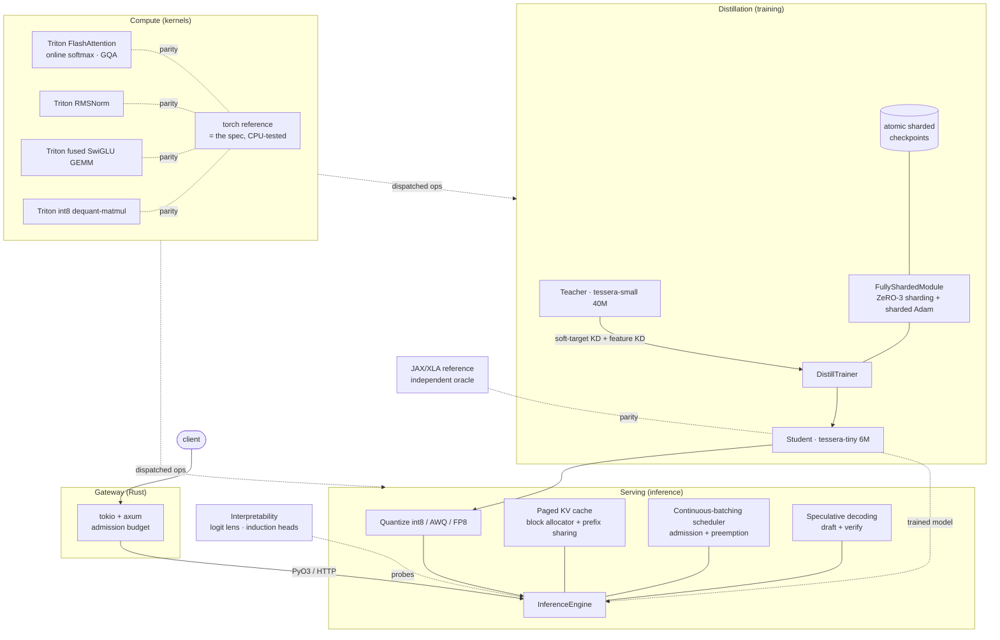

# Architecture

Tessera is one coherent pipeline: **distill** a large teacher into a small student, then
**serve** that student fast. Every layer of the modern LLM-systems stack shows up because the
end-to-end goal forces it to.

## Why each piece exists

| Layer | Component | Stack item it demonstrates |
|---|---|---|
| Kernels | [`kernels/triton/flash_attention.py`](../tessera/kernels/triton/flash_attention.py) | Custom FlashAttention-class operator, online softmax, GQA |
| Kernels | [`kernels/cuda/*.cu`](../tessera/kernels/cuda/) | Raw CUDA C++: shared memory, coalescing, warp reductions |
| Kernels | [`profiling/nvtx.py`](../tessera/profiling/nvtx.py) + [cuda/README](../tessera/kernels/cuda/README.md) | Nsight Systems/Compute, nvtx ranges |
| Distributed | [`distill/fsdp.py`](../tessera/distill/fsdp.py) | FSDP / ZeRO-3 sharding, NCCL/gloo collectives, sharded optimizer |
| Distributed | [`distill/checkpoint.py`](../tessera/distill/checkpoint.py) | Fault-tolerant, atomic, sharded checkpoint/resume |
| Inference | [`serve/paged_kv.py`](../tessera/serve/paged_kv.py) | Paged KV cache, prefix sharing |
| Inference | [`serve/scheduler.py`](../tessera/serve/scheduler.py) | Continuous batching, admission control, preemption |
| Inference | [`serve/speculative.py`](../tessera/serve/speculative.py) | Speculative decoding |
| Inference | [`quant/`](../tessera/quant/) | GPTQ-style int8, AWQ, FP8 (E4M3) |
| Systems | [`tessera-rs/`](../tessera-rs/) | Rust tokio/axum server, PyO3 bindings |
| Frameworks | [`jax_ref/`](../jax_ref/) | JAX/XLA, jit, an independent oracle |
| Interp | [`interp/`](../tessera/interp/) | Activation hooks, logit lens, induction heads |
| Data | [`data/`](../tessera/data/) | Byte-BPE tokenizer, packing, image/audio front ends |

## The dispatch trick

The model never imports a kernel directly — it calls ops in [`tessera/kernels/__init__.py`](../tessera/kernels/__init__.py),
which pick **Triton on CUDA** and the **torch reference everywhere else**. That single
indirection is why the entire stack is developed and unit-tested on a laptop (CPU/Apple MPS)
while the exact same call sites run hand-written kernels in production, and why the kernels
have a continuously-checked definition of "correct" (`tests/test_kernels_gpu.py`).
